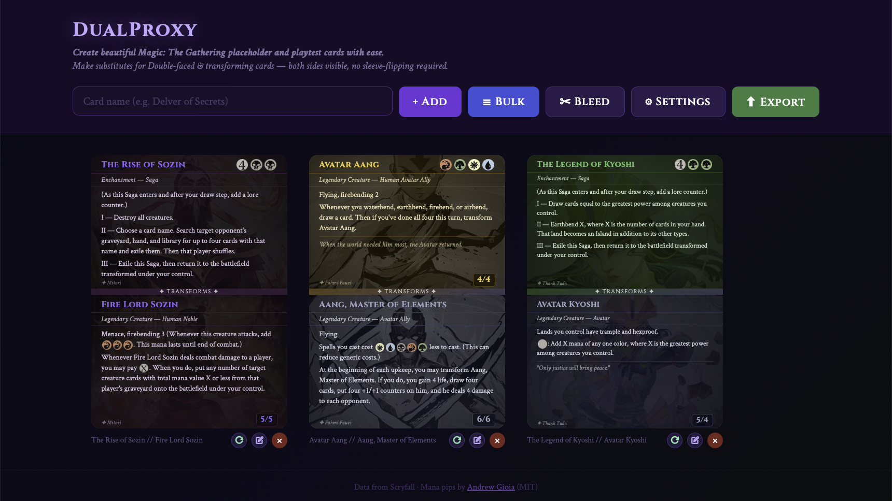
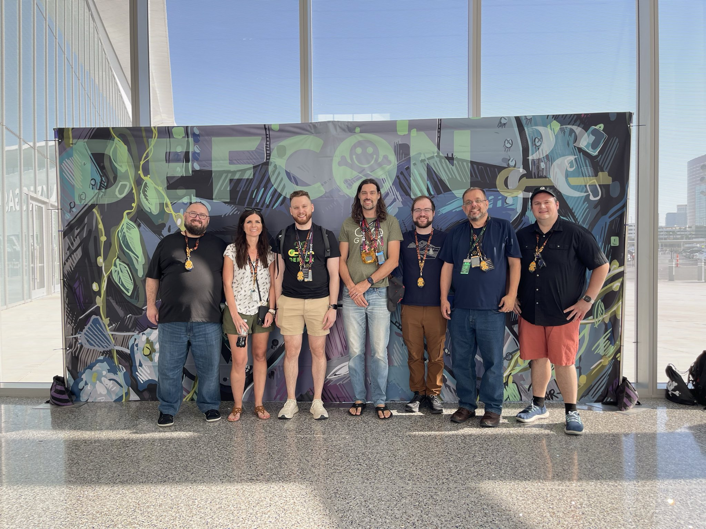
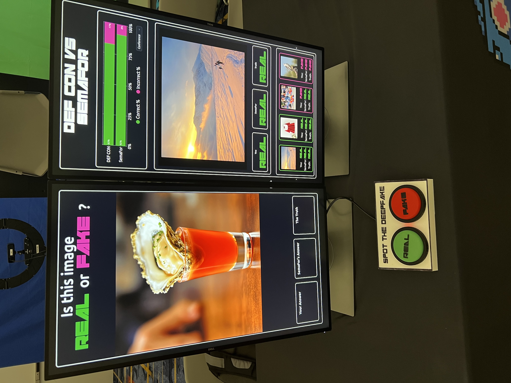
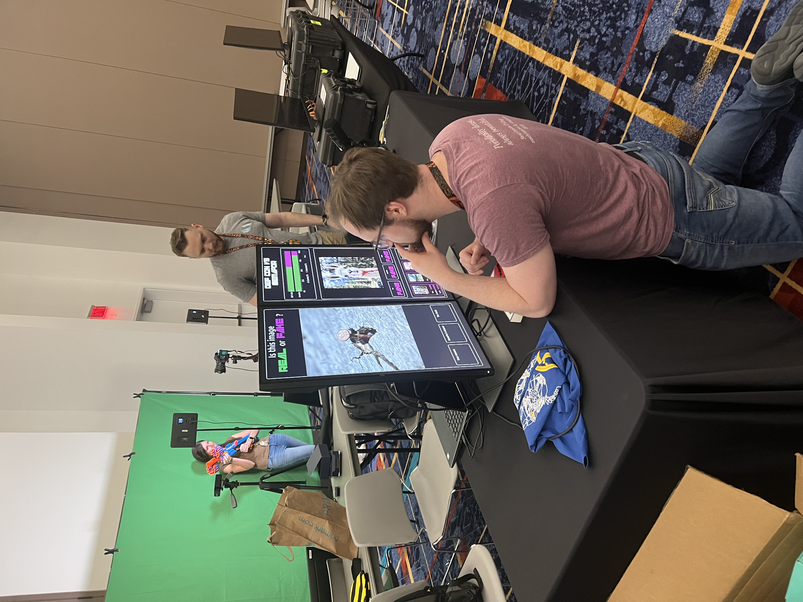
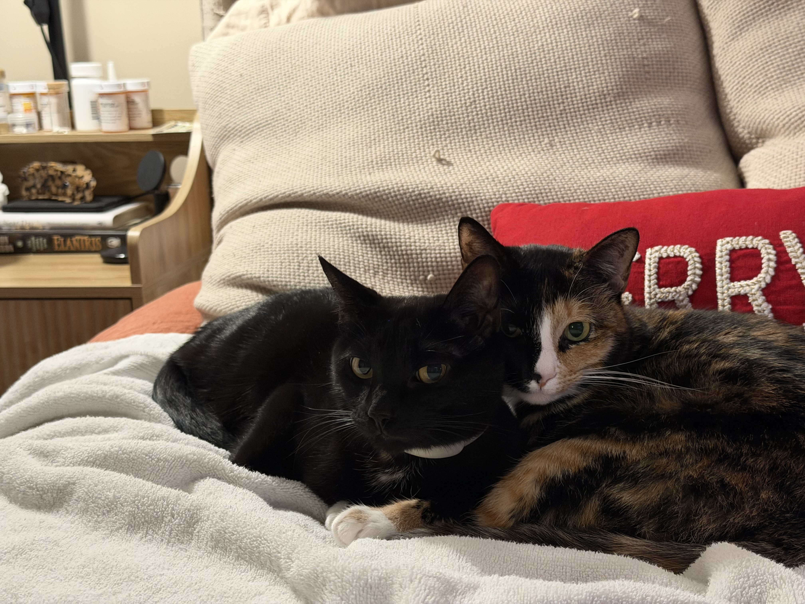

# Hey, I'm Matt 👋

Senior Software Engineer based in Arlington, VA. I build distributed systems by day and personal (recently MTG focused) web-apps for fun by night. I've shipped TRL-9 government systems, worked DARPA programs, and a game that hundreds of people played at DEF CON 33. Currently working on something smaller and more magical.
   
- 🎓 M.S. Applied Computer Science — The George Washington University '25
- 📄 Published in [HCI International 2025](https://link.springer.com/chapter/10.1007/978-3-031-94150-4_41) — ML applied to medical imaging anomaly detection
- 🏢 Senior Research Engineer @ Lockheed Martin ATL
- 🃏 Friendly LGS Enthusiast (And someday, a founder of one!)

---

## 🚀 Project Highlights

### Current Project: [DualProxy](https://dualproxy.app) — MTG Proxy Card Generator
> *Recently open-sourced*

A clean, fast substitute card generator for Magic: The Gathering cards. Built for Cube designers who want nice looking substitude cards for their dual faced cards, and Commander players who want to test decks before buying in. Pulls card data and art from the Scryfall API with support for double-faced cards, art crops, version selection, and print-ready output.
  

 
**Stack:** TypeScript · Scryfall API · Vite

[🎧 Live Demo](https://dualproxy.app) · [📂 Source](https://github.com/latterArrays/dualproxy)

---

### [3DStage](https://latterarrays.github.io/3DStage) — Spatial Audio Mixer
> *GWU Class Project*

A browser-based 3D audio-visual music creation tool. Drag instruments around a virtual stage to spatialize their audio in real time. Features stereo spatialization via the Web Audio API, HRTF panning, pitch shifting by vertical position, and audio recording.

**Stack:** Three.js · Web Audio API · Vite · JavaScript

[🎧 Live Demo](https://latterarrays.github.io/3DStage) · [📂 Source](https://github.com/latterArrays/3DStage)

---

## 🎪 DEF CON 33

 In 2025 I checked off a huge item from my nerd bucket list: I exhibited at DEF CON 33 as part of a DARPA research program [SemaFor — Semantic Forensics](https://www.darpa.mil/research/programs/semantic-forensics). I built a **"Real or Fake"** interactive game from scratch — a real-time fake media detection experience that was played over *2000* times on the floor by conference-goers who wanted to see if they could outsmart our fake media detection tool.

| | |
|---|---|
|    |  |
> *Built in about 2 months with Vite + React + shadcn/ui, right in time for the con. Sadly closed source, but it worked great!*
---

## 🛠 What I work with

> Languages:    TypeScript · Python · Java · C++ · Learning Go
> Frontend:     React · Vite · Angular (under duress) · Learning Vue
> Backend:      PostgreSQL · Redis · Spark · Kafka · Node.js · Firebase · Supabase
> Deployment:   Kubernetes · Docker · GitLab CI/CD · Cloudflare · Learning Terraform & Ansible

---

## 🃏 Outside of code

I'm married to the amazing [Emily Winchester](https://www.newamerica.org/people/emily-winchester/) and proud parent of two cats, Waffle and Pancake.
|  |  

I've recently gotten REALLY into 3D printing (much to my wife's delight), mostly accessories for Magic The Gathering. My pride and joy: [The Cube!](https://cubecobra.com/cube/list/avatarTLA) 

  
I enjoy hiking and can occasionally be found outdoors.

|  |  

I'm co-founding **Hexagon Games** this year — a local game community (and someday, an FLGS!) starting online and building toward a physical location in Northern Virginia. If you're in the area and play Commander or Wingspan (or anything else made of cardboard), [let's game!](https://discord.gg/jn744fzZ)

---

*I like interesting problems. Especially ones involving cards.*
